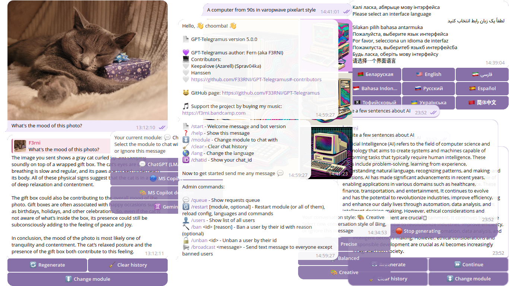

# 🤖 GPT-Telegramus v5

|  | <h3>The best Telegram bot for ChatGPT, Microsoft Copilot (aka Bing AI, aka Sidney, aka EdgeGPT), Microsoft Copilot Designer (aka BingImageCreator) and Gemini with stream writing, requests with images (currently, for Gemini only), multiple languages, admin control, data logging and more!</h3> |
| -------------------------------- | :--------------------------------------------------------------------------------------------------------------------------------------------------------------------------------------------------------------------------------------------------------------------------------------------------: |

<div style="width:100%;text-align:center;">
    <p align="center">
        
    </p>
</div>
<div style="width:100%;text-align:center;">
    <p align="center">
        <a href="https://www.youtube.com/@F3RNI"></a>
        <a href="https://f3rni.bandcamp.com"></a>
        <a href="https://open.spotify.com/artist/22PQ62alehywlYiksbtzsm"></a>
        <a href="https://soundcloud.com/f3rni"></a>
    </p>
</div>



----------

## 🚧 GPT-Telegramus is under heavy development

> 😔 Currently, GPT-Telegramus doesn't have paid ChatGPT and DALL-E support
>
> 📈 GPT-Telegramus v5 is an updated and highly refactored version of the old GPT-Telegramus. Updates coming soon....
>
> 📄 Documentation is also under development! Consider reading docstring for now
>
> 🐛 If you find a **bug** in GPT-Telegramus, please create an Issue

----------

## 😋 Support project

> 💜 Please support the project so that I can continue to develop it

- BTC: `bc1qd2j53p9nplxcx4uyrv322t3mg0t93pz6m5lnft`
- ETH: `0x284E6121362ea1C69528eDEdc309fC8b90fA5578`
- ZEC: `t1Jb5tH61zcSTy2QyfsxftUEWHikdSYpPoz`

- Or by my music on [🟦 bandcamp](https://f3rni.bandcamp.com/)

- Or message me if you would like to donate in other way 💰

[](https://star-history.com/#F33RNI/GPT-Telegramus&Date)

----------

## 🤗 Contributors

- 💜 [Sprav04ka](https://github.com/Sprav04ka) - *Tofii'skovyi' language, Testing, Super beautiful poster, Project Logo, Motivation*
- 💜 [Hanssen](https://github.com/Hanssen0) - *Markdown parsing, bard images, /chat command, caption fix, loading emoji, dynamic splitting, code block splitting, Gemini module, Docker fix, GitHub actions fix* **and much much more**
- 💜 [Sergey Krashevich](https://github.com/skrashevich) - *Docker, GitHub Actions*
- 💜 [Wahit Fitriyanto](https://github.com/wahitftry) - *Indonesian language*
- 💜 [Alexander Fadeyev](https://github.com/alfsoft) - *EdgeGPT Fix*
- 💜 AnthroAsja - *Belarusian language*
- 💜 Anonymous Samurai - *Ukrainian language*
- 💜 Dunya Jafari - *Persian language*

----------

## 🏗️ Requirements

- Python **3.10** / **3.11** *(not tested on other versions)*
- Unblocked access to the telegram bot official API
- Other requirements specified in the `requirements.txt` file

----------

## 📙 Project based on

- **F33RNI/LMAO API** (Unofficial open APIs): <https://github.com/F33RNI/LlM-Api-Open>
- **acheong08/EdgeGPT** (API): <https://github.com/acheong08/EdgeGPT>
- **jacobgelling/EdgeGPT** (API): <https://github.com/jacobgelling/EdgeGPT>
- **acheong08/BingImageCreator** (API): <https://github.com/acheong08/BingImageCreator>
- **google/generative-ai-python** (API): <https://github.com/google/generative-ai-python>
- **python-telegram-bot** (Telegram bot API): <https://github.com/python-telegram-bot/python-telegram-bot>

----------

## ❓ Get started

See **🐧 Running as service on linux**, **🍓 Running on Raspberry Pi (ARM)**, **🐋 Running in Docker** sections for more info

1. Install Python **3.10** / **3.11** *(not tested on other versions)*, `venv` and `pip`
2. Download source code (clone repo)
3. Create venv `python -m venv venv` / `python3 -m venv venv` / `python3.10 -m venv venv` / `python3.11 -m venv venv`
4. Activate venv `source venv/bin/activate` / `venv\Scripts\activate.bat`
5. Check python version using `python --version` command
6. Install requirements `pip install -r requirements.txt --upgrade`
7. Carefully change all the settings in `config.json` file and in each `*.json` file inside `module_configs` directory. If you have questions regarding any setting, open an issue, I'll try to add a more detailed description
8. Run main script `python main.py`

- **ChatGPT**
  - Free browser-like Chat-GPT. Currently, without extensions and image requests (text only) (because I don't have a paid account to test it)
  - Stream response support
  - Chat history support
  - See <https://github.com/F33RNI/LlM-Api-Open> for more info
- **Microsoft Copilot (aka EdgeGPT aka Bing AI aka Sydney)**
  - Supports conversation style `/style`
  - Stream response support
  - Chat history support
  - Web-browsing (probably) and sources support
  - Unfortunately, it can't accept images as input yet, nor can it generate them. Please use **Microsoft Copilot Designer** to generate images
- **Microsoft Copilot Designer**
  - Bing Image Generator. Used as a separate module due to issues with the EdgeGPT module
  - Free and unlimited
- **Gemini**
  - Google's AI using the Gemini Pro model
  - Chat history support
  - Requests with images (you can send an image with text to it)
  - Requests with images will not be recorded in the chat history since Google hasn't support this

----------

## 🐧 Running as service on linux

1. Install Python **3.10** / **3.11** *(not tested on other versions)*, `venv` and `pip`
2. Clone repo
   1. `git clone https://github.com/F33RNI/GPT-Telegramus.git`
   2. `cd GPT-Telegramus`
3. Create venv `python -m venv venv` / `python3 -m venv venv` / `python3.10 -m venv venv` / `python3.11 -m venv venv`
4. Carefully change all the settings in `config.json` file and in each `*.json` file inside `module_configs` directory
5. Install systemd
   1. `sudo apt-get install -y systemd`
6. Create new service file
   1. `sudo nano /etc/systemd/system/gpt-telegramus.service`

      ```ini
      [Unit]
      Description=GPT-Telegramus service
      After=multi-user.target
      
      [Service]
      Type=simple
      Restart=on-failure
      RestartSec=5
      
      WorkingDirectory=YOUR DIRECTORY HERE/GPT-Telegramus
      ExecStart=YOUR DIRECTORY HERE/GPT-Telegramus/run.sh
      
      [Install]
      WantedBy=multi-user.target
      
      ```

7. Reload systemctl daemon
   1. `sudo systemctl daemon-reload`
8. Enable and start service
   1. `sudo systemctl enable gpt-telegramus`
   2. `sudo systemctl start gpt-telegramus`
9. Note: Please use `sudo systemctl kill gpt-telegramus` and then `sudo systemctl stop gpt-telegramus` if only `sudo systemctl stop gpt-telegramus` not working

----------

## 🍓 Running on Raspberry Pi (ARM)

> Just follow the `🐧 Running as service on linux` guide

----------

## 🐋 Running in Docker

### From GitHub Package

1. Clone repo or download [`config.json`](./config.json) and [`module_configs`](./module_configs) and [`langs`](./langs)
2. Edit the `config.json`, set options in the `files` section to the path in the container (`/app/config/<FILE_NAME>`)
3. Run the container

   ```shell
   docker run -d -e TELEGRAMUS_CONFIG_FILE="/app/config/config.json" -v <YOUR_CONFIG_FOLDER>:/app/config --name gpt-telegramus --restart on-failure ghcr.io/f33rni/gpt-telegramus:latest
   ```

   If you want to try the preview version

   ```shell
   docker run -d -e TELEGRAMUS_CONFIG_FILE="/app/config/config.json" -v <YOUR_CONFIG_FOLDER>:/app/config --name gpt-telegramus --restart on-failure ghcr.io/f33rni/gpt-telegramus:edge
   ```

### Build Manually

1. Install Docker
2. Clone repo
3. Build container

    ```shell
    docker buildx build -t telegramus --load -f Dockerfile .
    ```

4. Run the container

    ```shell
    docker run -d --name gpt-telegramus --restart on-failure telegramus
    ```

   or if you want to use a custom config

   ```shell
   docker run -d -e TELEGRAMUS_CONFIG_FILE="/app/config/config.json" -v <YOUR_CONFIG_FOLDER>:/app/config --name gpt-telegramus --restart on-failure telegramus
   ```

----------

## 🌐 Bot messages

### Currently available languages

- 🇺🇸 English
- 🇷🇺 Русский
- ‍☠️ Тофийсковый
- 🇮🇩 Bahasa Indonesia
- 🇨🇳 简体中文
- 🇧🇾 Беларуская
- 🇺🇦 Українська
- فارسی 🇮🇷

You can add **a new language**. For that:

1. Copy any existing language file (inside `langs` directory)
2. Rename it according to `Set2/T` (3-letters code) **ISO 639** <https://en.wikipedia.org/wiki/List_of_ISO_639_language_codes>
3. Translate each entry
4. Create a pull request 💜

> You can add new lines by adding `\n`
>
> ⚠️ Please make sure you haven't messed up the string formatting structure `{this_type}`

----------

## 🤖 Telegram bot commands

- 📄 `/start` - Welcome message and bot version
- ❓ `/help` - Show help message
- ↕️ `/module` - Change module to chat with
- 🧹 `/clear` - Clear chat history
- 🌎 `/lang` - Change the language
- 🆔 `/chatid` - Show your chat_id
- `/style` - Bing AI conversation style
- Other direct module commands (please check automatically-generated list of commands inside bot)

### Admin commands

- 💬 `/queue` - Show requests queue
- 🔃 `/restart [module name, optional]` - Restart specific module (**and it's config**) or every module and all configs, languages and bot commands
  - Please see `bot_command_restart` function in `bot_handler.py` file for more info
- 👤 `/users` - Show list of all users
- 🔨 `/ban <id> [reason]` - Ban a user by their id with reason (optional)
- 🔓 `/unban <id>` - Unban a user by their id
- 📢 `/broadcast <message>` - Send text message to everyone except banned users

----------

## 📜 Data collecting

GPT-Telegramus has a built-in data collecting function (saves requests and responses in a files)

- **For text requests / responses** will be saved as plain text
- **For image requests / responses** will be saved as Base64-encoded image (in the same text file)

You can enable and configure data collection in `config.json` in `data_collecting` section

> ⚠️ Please make sure you notify your bot users that you're collecting data

----------

## 📝 TODO

- Official (and paid) ChatGPT API
- Official DALL-E API
- Microsoft Copilot as part of LMAO API
- Some free GPT-4 model

----------

## ✨ Contribution

- Anyone can contribute! Just create a **pull request**
