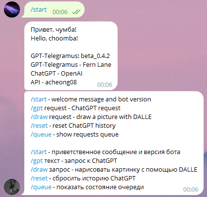
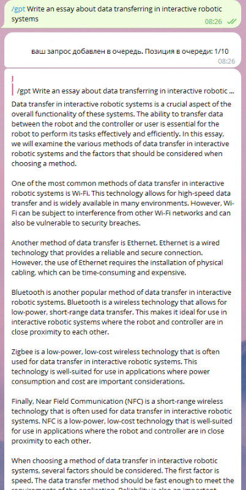
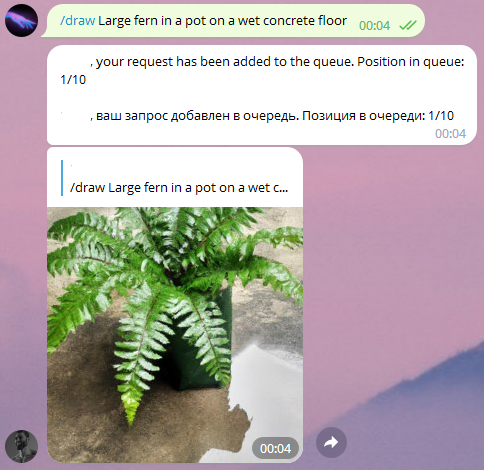

# GPT-Telegramus
## ChatGPT and DALLE implementation as a telegram bot
<div style="width:100%;text-align:center;">
    <p align="center">
        
        <a href="https://soundcloud.com/f3rni"></a>
    </p>
</div>
<div style="width:100%;text-align:center;">
    <p align="center">
        
        
        
    </p>
</div>

----------

## Dependencies

- **ChatGPT** (ChatGPT by OpenAI): https://chat.openai.com/chat
- **DALLE** (DALLE by OpenAI): https://openai.com/dall-e-2/
- **acheong08/ChatGPT** (API): https://github.com/acheong08/ChatGPT
- **python-telegram-bot** (Telegram bot API): https://github.com/python-telegram-bot/python-telegram-bot

----------

## Get started

1. Install Python and pip
2. Download source code
3. Install requirements `pip install -r requirements.txt --upgrade`
4. Create bot at https://t.me/BotFather
5. Type Bot's token into `telegram_api_key` in `settings.json` file
6. Create account at OpenAI
7. Generate API Key https://platform.openai.com/account/api-keys
8. Type OpenAI API Key into `open_ai_api_key` in `settings.json` file
9. Run main script `python main.py`

----------

## Bot messages

You can edit telegram bot messages by editing file `messages.json`. You can add new lines by adding `\\n`

Note: make shure you don't delete argumensts `{0}` in message and please restart script to apply changes

----------

## Running as service on linux

1. Install Python and pip
2. Clone repo
3. Fill `telegram_api_key` and `open_ai_api_key` in `settings.json` file
4. Install systemd `sudo apt-get install -y systemd`
5. Create new service file `sudo nano /etc/systemd/system/gpt-telegramus.service`
   ```
   [Unit]
   Description=GPT-Telegramus service
   After=multi-user.target
   
   [Service]
   Type=simple
   Restart=always
   WorkingDirectory=YOUR DIRECTORY HERE/GPT-Telegramus
   ExecStart=YOUR DIRECTORY HERE/GPT-Telegramus/run.sh
   RestartSec=5
   
   [Install]
   WantedBy=multi-user.target
   
   ```
6. Reload systemctl daemon `sudo systemctl daemon-reload`
7. Enable service `sudo systemctl enable gpt-telegramus.service`
8. Start service `sudo systemctl start gpt-telegramus.service`

----------

## Commands

- `/start` - Shows version
- `/help` - Shows list of commands
- `/queue` - Shows requests queue
- `/gpt YOUR REQUEST` - Request to ChatGPT
- `/draw YOUR REQUEST` - Request to DALLE
- Or just type your request as message without `/gpt` command

# This project is under development!
