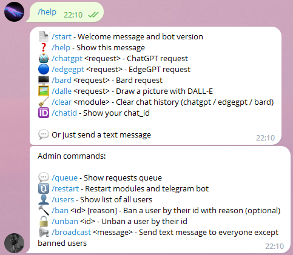

# GPT-Telegramus
## ChatGPT, EdgeGPT, DALL-E and Bard implementation as a telegram bot with admin control and automatic proxy searcher
<div style="width:100%;text-align:center;">
   <p align="center">
      
   </p>
</div>
<div style="width:100%;text-align:center;">
   <p align="center">
      <a href="https://www.youtube.com/@F3RNI"></a>
      <a href="https://f3rni.bandcamp.com"></a>
      <a href="https://open.spotify.com/artist/22PQ62alehywlYiksbtzsm"></a>
      <a href="https://soundcloud.com/f3rni"></a>
   </p>
</div>
<div style="width:100%;text-align:center;">
   <p align="center">
      
      
      
      
      
   </p>
</div>

----------

## Support project

Support the project by buying and listening to my music 🎵

- [Bandcamp](https://f3rni.bandcamp.com)
- [SoundCloud](https://soundcloud.com/f3rni)

----------

## Dependencies

- **ChatGPT** (ChatGPT by OpenAI): https://chat.openai.com/chat
- **EdgeGPT** (EdgeGPT by Microsoft): https://bing.com/chat
- **DALL-E** (DALLE by OpenAI): https://openai.com/dall-e-2/
- **Bard** (Bard by Google): https://bard.google.com/
- **acheong08/ChatGPT** (API): https://github.com/acheong08/ChatGPT
- **acheong08/EdgeGPT** (API): https://github.com/acheong08/EdgeGPT
- **acheong08/Bard** (API): https://github.com/acheong08/Bard
- **python-telegram-bot** (Telegram bot API): https://github.com/python-telegram-bot/python-telegram-bot

----------

## Get started

1. Install Python and pip
2. Download source code
3. Install requirements `pip install -r requirements.txt --upgrade`
4. Access the modules you want to use (Generate an API key to ChatGPT / DALL-E, save cookies for EdgeGPT / Bard)
5. Carefully change all the settings (in the `config.json` file) to suit your needs. If you have questions regarding any setting, open an issue, I will add a more detailed description
6. Create bot at https://t.me/BotFather
7. Type Bot's token into `api_key` in `telegram` in `config.json` file
8. Run main script `python main.py`

----------

## Bot messages

You can edit telegram bot messages by editing file `messages.json`. You can add new lines by adding `\\n`

Note: make sure you don't delete argumensts `{0}`, `{1}`, ... in message and please restart script to apply changes

----------

## Running as service on linux

1. Install Python and pip
2. Clone repo
3. Edit `config.json`
4. Install systemd `sudo apt-get install -y systemd`
5. Create new service file `sudo nano /etc/systemd/system/gpt-telegramus.service`
   ```
   [Unit]
   Description=GPT-Telegramus service
   After=multi-user.target
   
   [Service]
   Type=simple
   Restart=always
   WorkingDirectory=YOUR DIRECTORY HERE/GPT-Telegramus
   ExecStart=YOUR DIRECTORY HERE/GPT-Telegramus/run.sh
   RestartSec=5
   
   [Install]
   WantedBy=multi-user.target
   
   ```
6. Reload systemctl daemon `sudo systemctl daemon-reload`
7. Enable service `sudo systemctl enable gpt-telegramus.service`
8. Start service `sudo systemctl start gpt-telegramus.service`

----------

## Running in Docker

**WARNING: not tested**

1. Install Docker
2. Clone repo
3. Build container
    ```shell
    docker buildx build -t telegramus --load -f Dockerfile .
    ```
4. Run the container
    ```shell
    docker run -d --name gpt-telegramus --restart on-failure telegramus
    ```

**Note:** You can specify settings and messages files and chats folder location. (default location is in project folder):
```shell
docker run -d -e TELEGRAMUS_SETTINGS_FILE="PATH_TO_config.json" --name gpt-telegramus --restart on-failure telegramus
```

----------

## Proxy to bypass geo-blocking

It is possible to bypass geo-blocking of ChatGPT, EdgeGPT, DALL-E or Bard. GPT-Telegramus includes automatic proxy-list downloading with periodic checks

1. Set `enabled` in `proxy_automation` in `config.json` to `true`
2. Set `auto` in `proxy` for modules you want to connect automatic proxy search
3. Restart app and hope for the best. 

GPT-Telegramus will download the proxy list itself and start trying various proxies (see console for logs).
Sometimes, searching for a proxy can take a long time. If you think that the found proxy is not suitable, you can restart the bot using the `/restart` command

----------

## Telegram bot commands

- `/start` - Welcome message and bot version
- `/help` - Show this message
- `/chatgpt <request>` - ChatGPT request
- `/edgegpt <request>` - EdgeGPT request
- `/bard <request>` - Bard request
- `/dalle <request>` - Draw a picture with DALL-E
- `/clear <module>` - Clear chat history (chatgpt / edgegpt / bard)
- `/chatid` - Show your chat_id
Or just send a text message

Admin commands:
- `/queue` - Show requests queue
- `/restart` - Restart modules and telegram bot
- `/users` - Show list of all users
- `/ban <id> [reason]` - Ban a user by their id with reason (optional)
- `/unban <id>` - Unban a user by their id
- `/broadcast <message>` - Send text message to everyone except banned users

----------

## Chat history

GPT-Telegramus saves only ChatGPT chat history locally (`"conversations_dir": "conversations"`). Other modules either have a built-in ability to save chat history or do not have the ability to split conversations

----------

## TODO

- Add some free GPT-4 model

----------

## Contribution

- Anyone can contribute! Just create a pull request

----------

## P.S. This project is still under development!
